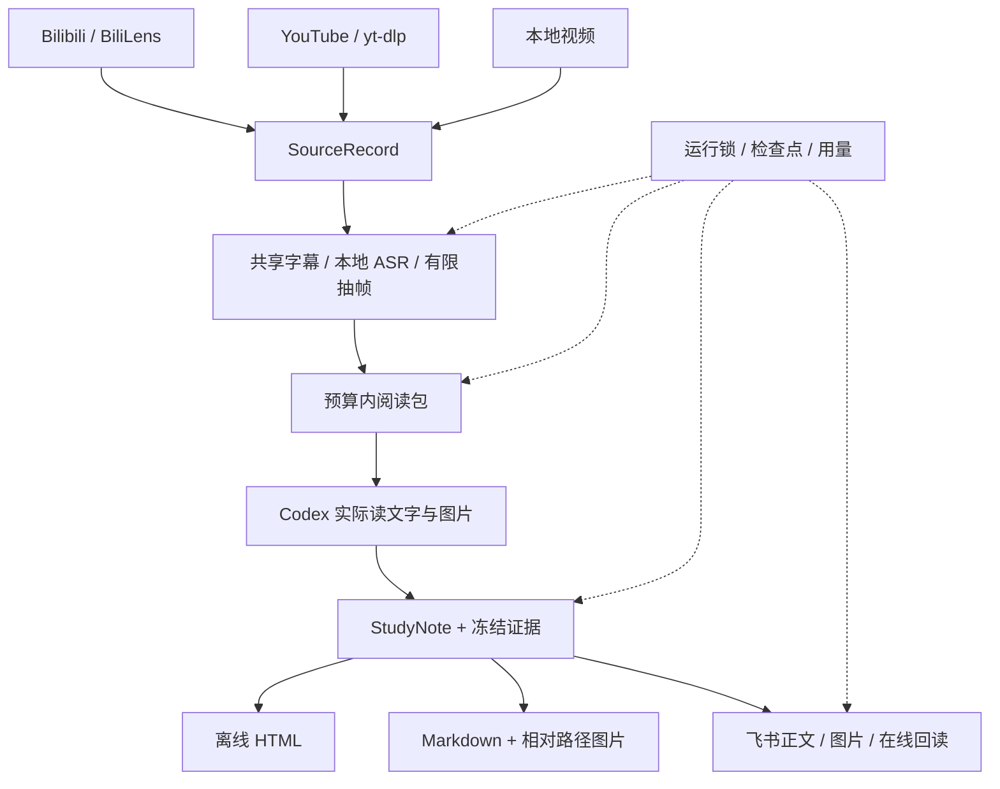

# 实现结构

来源、理解、表达和外部交付各自有一个边界。当前支持单个 Bilibili 分 P、YouTube 视频和本地文件；输出复用同一份版本化笔记。

| 模块 | 拥有的责任 |
| --- | --- |
| `sources/` | 平台识别、元数据、字幕、短期媒体访问、原视频时间链接 |
| `contracts.py` | 来源契约与 URL/时长边界 |
| `materials.py` | 素材准备、共享 FFmpeg/ASR、帧缓存、下一段运行 |
| `sampling.py` | 低分辨率稳定变化候选、跨整段时间分桶选择 |
| `reading.py` | 字幕段 ID、联系表、细读包与展示预算预留 |
| `run.py` | 文件、预算、时间轴、运行锁、命令活动记录 |
| `usage.py` | 阅读声明、完成状态、真实/估计/未知计数及账本去重 |
| `notes.py` | 内容、证据引用、快照、版本、各输出共用的范围与用量 |
| `delivery/` | HTML、MD、飞书表达；外部写入回执及恢复 |
| `cli.py` | 便携命令分派；实际理解仍由 skill 指导 Codex 完成 |

## 来源边界

适配器的 `resolve` 返回 `SourceRecord`；`media` 返回只用于当前 FFmpeg 调用的 URL/选项。CID、DASH、yt-dlp 原始 JSON 和签名 URL 留在适配器内部。`timestamp_url` 统一产生原视频跳转链接。只有 YouTube 分支按需检测 yt-dlp/EJS/JS runtime；其他来源不依赖它们。

`SourceRecord` 保存平台、公开视频身份/所选 part、标题、时长、字幕来源/语言及原始秒数。未知字幕保持缺失，不拿标题代替语音。源字幕、ASR、分段截取和配图使用同一原视频时间轴。

## 理解与证据边界

每段最长 30 分钟，材料在预设预算内；概览覆盖整段，关键步骤再局部细读。阅读包记录确切的 `segment_ids` 和 `frame_ids`。提取成功、展示预留、Agent 声明已读分别记录。声明不能证明事实正确，Agent 必须实际看图并核对解释。

`finish` 关闭本次阅读并写一次历史视频账目。`continue` 从 remaining_range 创建独立新 run，不改旧范围、旧笔记或旧账目。不同 run 可以独立运行，同一个 run 的命令由锁保护。失败保存已完成素材；重试复用缓存。

StudyNote 的段落、列表、代码、公式、表格、图片节点带证据引用及 speaker/agent/uncertain 归属。保存时校验已读声明和时间范围；快照复制、校验配图哈希。版本不可覆盖，重复相同输入复用版本。只拿到笔记快照及其相对资源也能导出，原始 run 或媒体路径后来变化不会改旧输出。

## 交付与恢复边界

HTML、MD、飞书消费同一份笔记和证据，不重新转写、读图或调用模型。HTML 离线嵌图；MD 的相对资源随文件移动，纯文本模式保留图注和时间点。HTML/MD 保存可读公式源，飞书映射原生 LaTeX；复杂排版不承诺逐像素相同。

飞书只新建独立管理文档；目标可为 new 或明确的 folder token。外部写入前保存 durable inflight 回执，结果未知时先核对远端而不盲目重建。已知文档的图像通过图注定位和远端字节哈希恢复；无法确认则停在未完成状态。重复发布在线回读同一文档，并保留回执冻结的原交付计划。改排版不会覆盖用户后来添加的正文。

## 计量边界

usage.json 是 prepare 到 finish 的冻结窗口；activities.jsonl 记录每条本地命令的状态与耗时，明确不包含 Agent 撰写/对话。原生 token 有本线程回执才记录；阶段不可分离时不制造阶段数字。候选扫描、提取帧、已读帧、文字粗估、实际 token 与独立 API 费用分列。导出脚本零模型调用不等于后续对话零额度消耗。

没有数据库、服务端或动态插件发现。新增来源主要实现一个适配器和来源测试；新增交付主要实现一个 delivery 模块与契约/失败恢复测试。
